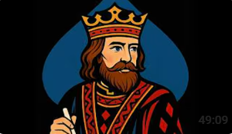

a Rails app for recording and analyzing results from the Wednesday Morning Tournament (youtube bridge content by Rob Barrington and Gavin Wolpert)

[Wednesday Morning Tournament](https://www.youtube.com/@bridgelesson)  
 

### Inital Steps

Used Cursor to establish